# Architecture Guide

This document outlines the structure, components, and data flow of the articles-extractor application.

## Overview

articles-extractor is a web scraping application that automatically extracts articles from multiple sources and stores them in a Google Sheet. It's designed to run on a schedule (via cron, Docker, or GitHub Actions) and support multiple article providers.

## High-Level Data Flow

```mermaid
graph TD
    A["📰 Article Sources"] --> B["freeCodeCamp<br/>GitHub Blog<br/>Shopify<br/>Substack"]
    B -->|HTTP Requests| C["🌐 Web Scraper Module<br/>Beautiful Soup + httpx"]
    C -->|Parsed HTML| D["🔍 Article Extractors<br/>Provider-specific parsers"]
    D -->|Article Data| E["☁️ Google Sheets API<br/>Store & Deduplicate"]
    E -->|Write| F["📊 User's Google Sheet<br/>articles + providers"]
    F -->|Read| D
```



**Data Flow Steps:**

1. Fetch web pages from configured provider URLs
2. Parse HTML using Beautiful Soup
3. Extract article information using provider-specific extractors
4. Check against existing titles for deduplication
5. Append new articles to Google Sheet
6. Sort and update metadata

## Project Structure

```plaintext
articles-extractor/
├── main.py                 # Entry point & orchestration
├── utils/                  # Core utility modules
│   ├── __init__.py        # Package exports
│   ├── sheet.py           # Google Sheets API interactions
│   ├── get_page.py        # Web fetching & HTTP client
│   ├── extractors.py      # Provider-specific article parsers
│   ├── format_date.py     # Date/time utilities
│   └── constants.py       # Configuration constants
├── .github/workflows/
│   └── scheduled_extraction.yml  # GitHub Actions workflow
├── Dockerfile            # Docker container setup
├── Makefile             # Development & deployment commands
├── requirements.txt     # Python dependencies
└── docs/                # Documentation
```

## Core Components

### 1. **Main Entry Point** (`main.py`)

Orchestrates the entire extraction process. Coordinates fetching providers,
deduplication, and article processing.

### 2. **Google Sheets Module** (`utils/sheet.py`)

Handles all Google Sheets API interactions—authentication, reading providers,
storing articles, and maintaining data.

### 3. **Web Fetching Module** (`utils/get_page.py`)

Manages HTTP requests with rate limiting (1 second between requests, 30-second timeout).
Handles page fetching and connection cleanup.

### 4. **Article Extractors** (`utils/extractors.py`)

Provider-specific HTML parsers. Supports freeCodeCamp, GitHub, Shopify, and Substack.
Each extractor handles deduplication and error handling independently.

### 5. **Utilities** (`utils/format_date.py`, `utils/constants.py`)

Date parsing/formatting and configuration constants used throughout the app.

## Data Models


**Provider Schema** (Google Sheet `providers` worksheet):

- `name`: Provider identifier (e.g., "freecodecamp", "github")
- `element`: CSS selector to find articles on the page
- `url`: Website URL to scrape

**Article Schema** (Google Sheet `articles` worksheet):

- `date`: Publication date (YYYY-MM-DD format)
- `title`: Article title
- `link`: Full URL to the article
- `source`: Provider name

## Processing Flow

```mermaid
flowchart TD
    Start["🚀 Start"]
    Init["Initialize<br/>Setup logging & auth"]
    GetProviders["Fetch Providers<br/>from Google Sheet"]
    GetTitles["Get Existing Titles<br/>for deduplication"]
    
    Start --> Init --> GetProviders --> GetTitles
    
    Process["Process Each Provider"]
    Skip["⏭️ Skip"]
    Fetch["Fetch Webpage"]
    Parse["Parse HTML<br/>Beautiful Soup"]
    Extract["Extract Articles<br/>Provider-specific parser"]
    CheckDup{"Duplicate<br/>check?"}
    Append["Append to<br/>Google Sheet"]
    
    GetTitles --> Process
    Skip --> Process
    Process --> Fetch --> Parse --> Extract --> CheckDup
    CheckDup -->|Yes| Skip
    CheckDup -->|No| Append --> Process
    
    AllDone["All providers<br/>processed?"]
    Sort["Sort Articles<br/>by date"]
    Update["Update Timestamp"]
    Log["Log Results"]
    Complete["✅ Complete"]
    
    Process -->|Yes| AllDone --> Sort --> Update --> Log --> Complete
```



## Dependencies

### External Libraries

- **gspread** - Google Sheets API client
- **google-auth** - Google authentication
- **beautifulsoup4** - HTML parsing
- **httpx** - Async HTTP client

### Google APIs

- **Google Sheets API** - Store and retrieve data
- **Google OAuth 2.0** - Authentication

## Configuration

### Environment Variables

- `SHEET_ID` - Google Sheet ID (required)
- `CREDENTIALS` - JSON credentials file (required for auth)

### Rate Limiting

Configured in `utils/constants.py`:

- Request interval between calls: 1.0 second
- HTTP timeout: 30 seconds

## Error Handling

The app uses a multi-layered error handling strategy:

1. **Provider-level errors** - Logged but processing continues for other providers
2. **Extraction errors** - Caught by `@extractor_error_handler` decorator
3. **Network errors** - Handled by httpx with timeout management
4. **API errors** - Logged with full traceback

All errors are written to stdout for capture in logs.

## Logging

- **Level**: INFO
- **Format**: `%(asctime)s - %(name)s - %(levelname)s - %(message)s`
- **Output**: stdout (captured in logs by GitHub Actions or Docker)

Key log messages:

- "Processed {provider}: X new articles found"
- "Failed to fetch page for {provider}"
- "Error processing {provider}: {error}"
- "Unknown provider: {provider}"

## Performance Considerations

- **Async processing** - Providers are processed sequentially (one at a time) but can be parallelized
- **Rate limiting** - 1 second between requests to be respectful to websites
- **Deduplication** - Articles are checked against existing titles before insertion
- **Sheet sorting** - Articles are sorted by date after all additions
