# Architecture Guide

This document outlines the structure, components, and data flow of the articles-extractor application.

## Overview

articles-extractor is a web scraping application that automatically extracts articles from multiple sources and stores them in a Google Sheet. It's designed to run on a schedule (via cron, Docker, or GitHub Actions) and support multiple article providers.

## High-Level Data Flow

```mermaid
graph TD
    A["📰 Article Sources"] --> B["freeCodeCamp<br/>GitHub Blog<br/>Shopify<br/>Substack"]
    B -->|HTTP Requests| C["🌐 Web Scraper Module<br/>Beautiful Soup + httpx"]
    C -->|Parsed HTML| D["🔍 Article Extractors<br/>Provider-specific parsers"]
    D -->|Article Data| E["☁️ Google Sheets API<br/>Store & Deduplicate"]
    E -->|Write| F["📊 User's Google Sheet<br/>articles + providers"]
    F -->|Read| D
```



**Data Flow Steps:**

1. Fetch web pages from configured provider URLs
2. Parse HTML using Beautiful Soup
3. Extract article information using provider-specific extractors
4. Check against existing titles for deduplication
5. Append new articles to Google Sheet
6. Sort and update metadata

## Project Structure

```plaintext
articles-extractor/
├── main.py                 # Entry point & orchestration
├── utils/                  # Core utility modules
│   ├── __init__.py        # Package exports
│   ├── sheet.py           # Google Sheets API interactions
│   ├── get_page.py        # Web fetching & HTTP client
│   ├── extractors.py      # Provider-specific article parsers
│   ├── format_date.py     # Date/time utilities
│   └── constants.py       # Configuration constants
├── .github/workflows/
│   └── scheduled_extraction.yml  # GitHub Actions workflow
├── Dockerfile            # Docker container setup
├── Makefile             # Development & deployment commands
├── requirements.txt     # Python dependencies
└── docs/                # Documentation
```

## Core Components

### 1. **Main Entry Point** (`main.py`)

The orchestration hub that coordinates the entire extraction process.

**Key Responsibilities:**

- Initialize logging
- Fetch providers from Google Sheet
- Get list of existing article titles (for deduplication)
- Process each provider asynchronously
- Update the sheet with timestamp

**Key Functions:**

- `async_main()` - Async orchestrator
- `process_provider()` - Process a single provider
- `main()` - Sync wrapper for async code

### 2. **Google Sheets Module** (`utils/sheet.py`)

Handles all interactions with the Google Sheets API.

**Key Responsibilities:**

- Authenticate with Google Sheets
- Read provider configurations from the sheet
- Fetch existing article titles for deduplication
- Append new articles to the sheet
- Sort and update metadata

**Key Functions:**

- `get_client()` - Authenticate and return gspread client
- `get_worksheet()` - Get a specific worksheet by name
- `get_all_providers()` - Read provider configs from sheet
- `get_all_titles()` - Get existing article titles
- `append_article()` - Add new article to sheet

### 3. **Web Fetching Module** (`utils/get_page.py`)

Manages HTTP requests and page fetching with respect to rate limits.

**Key Responsibilities:**

- Initialize and maintain HTTP client state
- Fetch web pages with error handling
- Respect request intervals (rate limiting)
- Handle timeouts and connection errors
- Gracefully close connections

**Key Functions:**

- `init_fetcher_state()` - Create HTTP client state
- `fetch_page()` - Fetch and parse HTML from URL
- `close_fetcher()` - Clean up resources

**Rate Limiting:**

- Default request interval: 1.0 second
- Default timeout: 30 seconds

### 4. **Article Extractors Module** (`utils/extractors.py`)

Provider-specific HTML parsers that extract article information.

**Supported Providers:**

| Provider     | CSS Element | Extracted Fields                |
|-------------|-------------|------------------------------|
| freeCodeCamp | `article`   | Title, Link, Date, Source    |
| GitHub Blog  | `article`   | Title, Link, Date, Source    |
| Shopify      | `article`   | Title, Link, Date, Source    |
| Substack     | Custom div  | Title, Link, Date, Source    |

**Key Functions:**

- `extract_fcc_articles()` - Parse freeCodeCamp articles
- `extract_github_articles()` - Parse GitHub blog articles
- `extract_shopify_articles()` - Parse Shopify engineering articles
- `extract_substack_articles()` - Parse Substack newsletters
- `provider_dict()` - Map providers to their extractors
- `get_articles()` - Extract articles and deduplicate

**Error Handling:**

- Each extractor uses `@extractor_error_handler` decorator
- Errors are logged but don't stop processing
- Non-matching articles are skipped

### 5. **Date/Time Utilities** (`utils/format_date.py`)

Handles date parsing and formatting.

**Key Functions:**

- `current_time()` - Get current date and time
- `clean_and_convert_date()` - Normalize date formats to YYYY-MM-DD

### 6. **Constants** (`utils/constants.py`)

Configuration values used throughout the app.

**Key Constants:**

- `ARTICLES_WORKSHEET` - Name of the articles sheet
- `PROVIDERS_WORKSHEET` - Name of the providers sheet
- `DEFAULT_REQUEST_INTERVAL` - Rate limiting delay
- `DEFAULT_TIMEOUT` - HTTP request timeout
- `GOOGLE_SHEETS_SCOPES` - API permissions

## Data Models

### Provider Configuration

Stored in Google Sheet's `providers` worksheet:

| name        | element (CSS selector) | url                          |
|-------------|------------------------|------------------------------|
| freecodecamp| article                | <https://www.freecodecamp.org/news/> |
| github      | article                | <https://github.blog/>      |
| shopify     | article                | <https://shopify.engineering/> |
| substack    | [custom selector]      | <https://yourname.substack.com/archive> |

### Article Data

Stored in Google Sheet's `articles` worksheet:

| Date       | Title         | Link           | Source     |
|------------|---------------|----------------|------------|
| 2024-10-18 | Article Title | https://...    | freeCodeCamp |

## Processing Flow

1. **Initialize** → Load config, setup logging, authenticate with Google
2. **Fetch Providers** → Read provider list from Google Sheet
3. **Get Existing Titles** → Read all article titles for deduplication
4. **Process Each Provider** (asynchronously):
   - Fetch the provider's webpage
   - Parse HTML using Beautiful Soup
   - Extract articles using provider-specific extractor
   - Filter out duplicates (by title)
   - Append new articles to Google Sheet
5. **Finalize** → Sort articles, update timestamp, close connections
6. **Log Results** → Report articles found per provider

## Dependencies

### External Libraries

- **gspread** - Google Sheets API client
- **google-auth** - Google authentication
- **beautifulsoup4** - HTML parsing
- **httpx** - Async HTTP client

### Google APIs

- **Google Sheets API** - Store and retrieve data
- **Google OAuth 2.0** - Authentication

## Configuration

### Environment Variables

- `SHEET_ID` - Google Sheet ID (required)
- `CREDENTIALS` - JSON credentials file (required for auth)

### Rate Limiting

Configured in `utils/constants.py`:

- Request interval between calls: 1.0 second
- HTTP timeout: 30 seconds

## Error Handling

The app uses a multi-layered error handling strategy:

1. **Provider-level errors** - Logged but processing continues for other providers
2. **Extraction errors** - Caught by `@extractor_error_handler` decorator
3. **Network errors** - Handled by httpx with timeout management
4. **API errors** - Logged with full traceback

All errors are written to stdout for capture in logs.

## Extensibility

### Adding a New Provider

1. **Add HTML parser** in `utils/extractors.py`:

   ```python
   @extractor_error_handler("NewProvider")
   def extract_newprovider_articles(article):
       title = article.find(...).get_text().strip()
       link = article.find(...).get("href")
       date = article.find(...).get("datetime")
       return (date, title, link, "newprovider")
   ```

2. **Add to provider dictionary** in the same file:

   ```python
   "newprovider": {
       "element": lambda: "css_selector",
       "extractor": extract_newprovider_articles
   }
   ```

3. **Add to Google Sheet** providers worksheet with the CSS selector and URL

4. **Test** by running the app manually

## Logging

- **Level**: INFO
- **Format**: `%(asctime)s - %(name)s - %(levelname)s - %(message)s`
- **Output**: stdout (captured in logs by GitHub Actions or Docker)

Key log messages:

- "Processed {provider}: X new articles found"
- "Failed to fetch page for {provider}"
- "Error processing {provider}: {error}"
- "Unknown provider: {provider}"

## Performance Considerations

- **Async processing** - Providers are processed sequentially (one at a time) but can be parallelized
- **Rate limiting** - 1 second between requests to be respectful to websites
- **Deduplication** - Articles are checked against existing titles before insertion
- **Sheet sorting** - Articles are sorted by date after all additions
